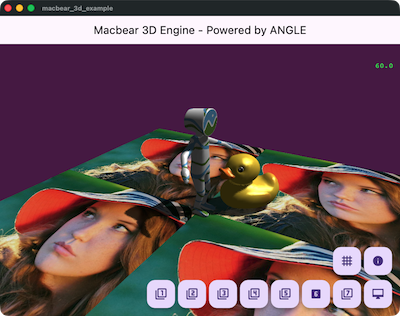

# Macbear 3D powered by ANGLE (OpenGL ES)

A powerful yet easy-to-use 3D engine for Flutter, powered by ANGLE (OpenGL ES).

Macbear 3D brings high-performance 3D rendering to Flutter applications with a simple API, enabling developers to create stunning 3D experiences, games, and visualizations.


## Features

- **High Performance**: Powered by `flutter_angle` for direct OpenGL ES interaction.
- **Cross-Platform**: Works seamlessly on iOS, Android, and macOS.
- **Scene Graph**: Flexible 3D scene management with Entity-Component architecture.
- **Primitives**: Built-in support for Cubes, Spheres, Planes, and more.
- **Model Loaders**: Easy loading of `glTF` and `OBJ` models.
- **Materials & Textures**: Support for standard materials, texturing, and transparency.
- **Lighting & Shadows**: Dynamic lighting and shadow mapping support.
- **Physics**: Integrated rigid body physics engine (via `oimo_physics`).
- **Touch Input**: Built-in touch event handling for 3D interactions.
  




<details>
<summary>More Screenshots</summary>


</details>

## Installation

Add `macbear_3d` to your `pubspec.yaml`:

```yaml
dependencies:
  macbear_3d: ^0.1.1
```

## Usage

Here is a simple example to display a 3D scene:

```dart
import 'dart:math';
import 'package:flutter/material.dart' hide Colors;
import 'package:macbear_3d/macbear_3d.dart';

void main() {
  M3AppEngine.instance.onDidInit = onDidInit;

  runApp(const MyApp());
}

Future<void> onDidInit() async {
  debugPrint('main_example.dart: onDidInit');
  await M3AppEngine.instance.setScene(MyScene());
}

class MyApp extends StatelessWidget {
  const MyApp({super.key});

  @override
  Widget build(BuildContext context) {
    return MaterialApp(
      home: Scaffold(
        appBar: AppBar(title: const Text('Macbear 3D Example')),
        body: const M3View(),
      ),
    );
  }
}

// Define a simple scene
class MyScene extends M3Scene {
  @override
  Future<void> load() async {
    if (isLoaded) return;
    await super.load();

    camera.setEuler(pi / 6, -pi / 6, 0, distance: 8);

    // add geometry
    addMesh(M3Mesh(M3BoxGeom(1.0, 1.0, 1.0)), Vector3.zero()).color = Colors.blue;
    addMesh(M3Mesh(M3SphereGeom(0.5)), Vector3(2, 0, 0)).color = Colors.red;
    addMesh(M3Mesh(M3TorusGeom(0.5, 0.3)), Vector3(0, 2, 0)).color = Colors.green;
    addMesh(M3Mesh(M3CylinderGeom(0.5, 0.0, 1.0)), Vector3(0, 0, 1)).color = Colors.yellow;
    addMesh(M3Mesh(M3PlaneGeom(5, 5)), Vector3(0, 0, -1));
  }
}
```

## Setup

To protect your usage, ensure you set `M3AppEngine.instance.onDidInit = onDidInit` and implement `onDidInit` method, then use `M3View` widget.

## Generate UML Diagram

https://pub.dev/packages/dcdg
```
./uml/gen_uml.sh
```
output to uml/macbear_3d.puml

## TODO

- [ ] Skinned Mesh
- [ ] Skeletal Animation
- [ ] Shadows improvements (Cascaded Shadow Maps)
- [ ] PBR Material support
- [ ] Post-processing effects (Bloom, HDR)
- [ ] Advanced Particle System
- [ ] Physics System
- [ ] Resource Management System
- [ ] GUI System
- [ ] WebGL support optimization

## Contributing

Contributions are welcome! Please feel free to check the [issues](https://github.com/macbearchen/macbear_3d/issues) or submit a Pull Request.

## License

This project is licensed under the MIT License - see the [LICENSE](LICENSE) file for details.
