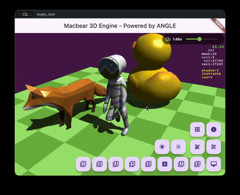
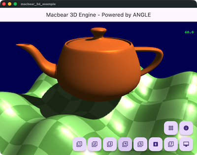
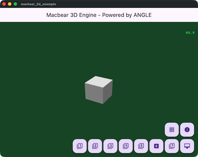
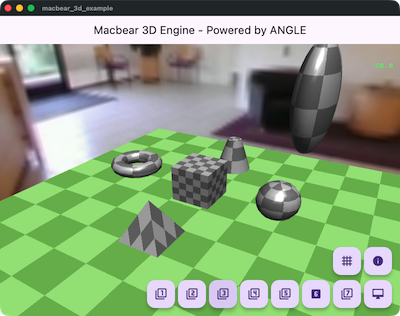
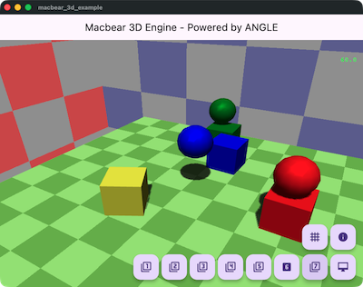
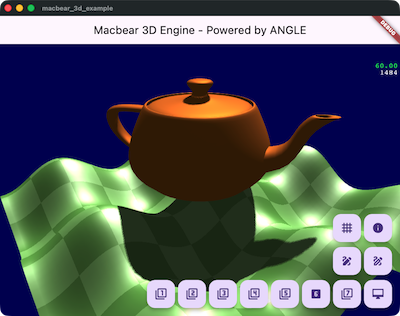
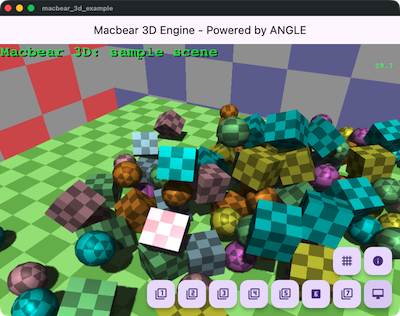
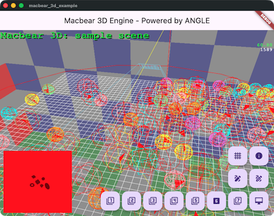

# Macbear 3D

[English](README.md) | [繁體中文](#macbear-3d-繁體中文)

[](https://pub.dev/packages/macbear_3d)
[](https://opensource.org/licenses/MIT)


**Macbear 3D** is a lightweight, high-performance 3D rendering engine for Flutter, powered by **Google ANGLE (OpenGL ES)**. It provides a simple yet powerful API to create stunning 3D experiences, games, and visualizations.

<p align="center">
  
  
</p>

## Key Features

### 🚀 Core Engine
- **Powered by ANGLE**: Direct OpenGL ES access via Google's ANGLE for high performance.
- **Scene Graph**: Flexible Entity-Component architecture and multi-camera support.
- **Resource Management**: Efficient centralized loading and caching for textures, meshes, and fonts.

### 🎨 Rendering & Visuals
- **Model Loaders**: Native support for **glTF/GLB** and **OBJ** formats.
- **Skeletal Animation**: Full support for skinned meshes and bone-based animations.
- **Advanced Lighting**: Dynamic lighting with **Cascaded Shadow Mapping (CSM)** for high-quality shadows.
- **Text Rendering**: Generate 3D geometry from TrueType/OpenType fonts.

### ⚙️ Physics & Interaction
- **Integrated Physics**: Seamless integration with the **oimo_physics** rigid body physics engine.
- **Collision Detection**: Automatic AABB and Bounding Sphere calculation.
- **Touch Input**: Built-in interaction handling for 3D objects and orbit control.

<p align="center">
  
  
</p>

<details>
<summary>More Screenshots</summary>








</details>

## Installation

Add `macbear_3d` to your `pubspec.yaml`:

```yaml
dependencies:
  macbear_3d: ^0.4.0
```

## Usage

Here is a simple example to display a 3D scene:

```dart
import 'dart:math';
import 'package:flutter/material.dart' hide Colors;
import 'package:macbear_3d/macbear_3d.dart';

void main() {
  M3AppEngine.instance.onDidInit = onDidInit;

  runApp(const MyApp());
}

Future<void> onDidInit() async {
  debugPrint('main_example.dart: onDidInit');
  await M3AppEngine.instance.setScene(MyScene());
}

class MyApp extends StatelessWidget {
  const MyApp({super.key});

  @override
  Widget build(BuildContext context) {
    return MaterialApp(
      home: Scaffold(
        appBar: AppBar(title: const Text('Macbear 3D Example')),
        body: const M3View(),
      ),
    );
  }
}

// Define a simple scene
class MyScene extends M3Scene {
  @override
  Future<void> load() async {
    if (isLoaded) return;
    await super.load();

    camera.setEuler(pi / 6, -pi / 6, 0, distance: 8);

    // add geometry
    addMesh(M3Mesh(M3BoxGeom(1.0, 1.0, 1.0)), Vector3.zero()).color = Colors.blue;
    addMesh(M3Mesh(M3SphereGeom(0.5)), Vector3(2, 0, 0)).color = Colors.red;
    addMesh(M3Mesh(M3TorusGeom(0.5, 0.3)), Vector3(0, 2, 0)).color = Colors.green;
    addMesh(M3Mesh(M3CylinderGeom(0.5, 0.0, 1.0)), Vector3(0, 0, 1)).color = Colors.yellow;
    addMesh(M3Mesh(M3PlaneGeom(5, 5)), Vector3(0, 0, -1));
  }
}
```

## Setup

To protect your usage, ensure you set `M3AppEngine.instance.onDidInit = onDidInit` and implement `onDidInit` method, then use `M3View` widget.

## Generate UML Diagram

https://pub.dev/packages/dcdg
```
./uml/gen_uml.sh
```
output to uml/macbear_3d.puml

## TODO

- [x] Skinned Mesh
- [x] Skeletal Animation
- [x] Shadows improvements (Cascaded Shadow Maps)
- [ ] PBR Material support
- [ ] Skybox reflection via cubemap
- [ ] Water effect (reflection, refraction)
- [ ] Post-processing effects (Bloom, HDR)
- [ ] Advanced Particle System
- [x] Resource Management System
- [x] Text Rendering
- [ ] GUI System
- [ ] WebGL support optimization

## Contributing

Contributions are welcome! Please feel free to check the [issues](https://github.com/macbearchen/macbear_3d/issues) or submit a Pull Request.

## License

This project is licensed under the MIT License - see the [LICENSE](LICENSE) file for details.
---

# Macbear 3D (繁體中文)

[English](#macbear-3d) | [繁體中文](README.md)

**Macbear 3D** 是一個專為 Flutter 打造的輕量級、高性能 3D 渲染引擎，由 **Google ANGLE (OpenGL ES)** 驅動。它提供簡單且強大的 API，讓開發者能夠輕鬆創建驚艷的 3D 體驗、遊戲與視覺化應用。

<p align="center">
  
  
</p>

## 主要特性

### 🚀 核心引擎
- **ANGLE 驅動**: 透過 Google ANGLE 直接整合 OpenGL ES，確保卓越性能。
- **場景圖 (Scene Graph)**: 靈活的實體-組件 (Entity-Component) 架構，支援多攝影機系統。
- **資源管理**: 預建的高效集中式加載與快取機制（紋理、模型、字體）。

### 🎨 渲染與視覺
- **模型加載**: 原生支援 **glTF/GLB** 與 **OBJ** 格式。
- **骨架動畫**: 完整支援皮膚網格 (Skinned Mesh) 與基於骨骼的動畫系統。
- **進階陰影**: 支援動態光照與 **級聯陰影貼圖 (CSM)**，提供大場景下的高品質陰影。
- **3D 文字**: 支援從 TrueType/OpenType 字體直接生成 3D 文字幾何體。

### ⚙️ 物理與交互
- **整合物理引擎**: 與 **oimo_physics** 剛體物理引擎無縫協作。
- **碰撞檢測**: 自動計算 AABB 與包圍球 (Bounding Sphere)。
- **觸控輸入**: 內建 3D 物體互動處理與軌軌道攝影機 (Orbit Control) 支援。

## 安裝

在您的 `pubspec.yaml` 中加入 `macbear_3d`：

```yaml
dependencies:
  macbear_3d: ^0.4.0
```

## 快速上手

以下是一個顯示 3D 場景的簡單示例：

```dart
import 'dart:math';
import 'package:flutter/material.dart' hide Colors;
import 'package:macbear_3d/macbear_3d.dart';

void main() {
  M3AppEngine.instance.onDidInit = onDidInit;
  runApp(const MyApp());
}

Future<void> onDidInit() async {
  await M3AppEngine.instance.setScene(MyScene());
}

class MyApp extends StatelessWidget {
  const MyApp({super.key});

  @override
  Widget build(BuildContext context) {
    return const MaterialApp(
      home: Scaffold(
        body: M3View(),
      ),
    );
  }
}

class MyScene extends M3Scene {
  @override
  Future<void> load() async {
    if (isLoaded) return;
    await super.load();
    camera.setEuler(pi / 6, -pi / 6, 0, distance: 8);
    addMesh(M3Mesh(M3BoxGeom(1.0, 1.0, 1.0)), Vector3.zero()).color = Colors.blue;
  }
}
```

## TODO / 路線圖

- [x] 皮膚網格 (Skinned Mesh)
- [x] 骨架動畫 (Skeletal Animation)
- [x] 陰影優化 (級聯陰影貼圖 CSM)
- [ ] PBR 材質支援
- [ ] 天空盒反射 (Cubemap)
- [ ] 水面效果 (反射、折射)
- [ ] 後處理特效 (Bloom, HDR)
- [ ] 進階粒子系統
- [ ] GUI 系統
- [ ] WebGL 支援優化

## 參與貢獻

歡迎任何形式的貢獻！如果您發現 Bug 或有新功能建議，請隨時提交 [Issues](https://github.com/macbearchen/macbear_3d/issues) 或 Pull Request。

## 開源協議

本專案採用 MIT 協議授權 - 詳情請參閱 [LICENSE](LICENSE) 文件。
