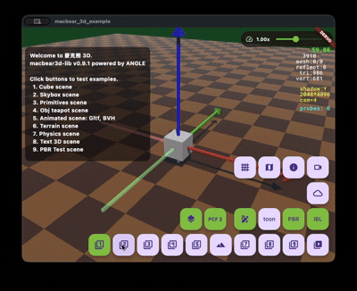
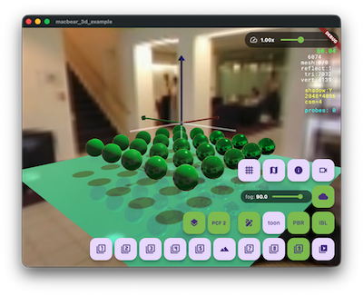
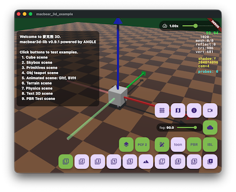
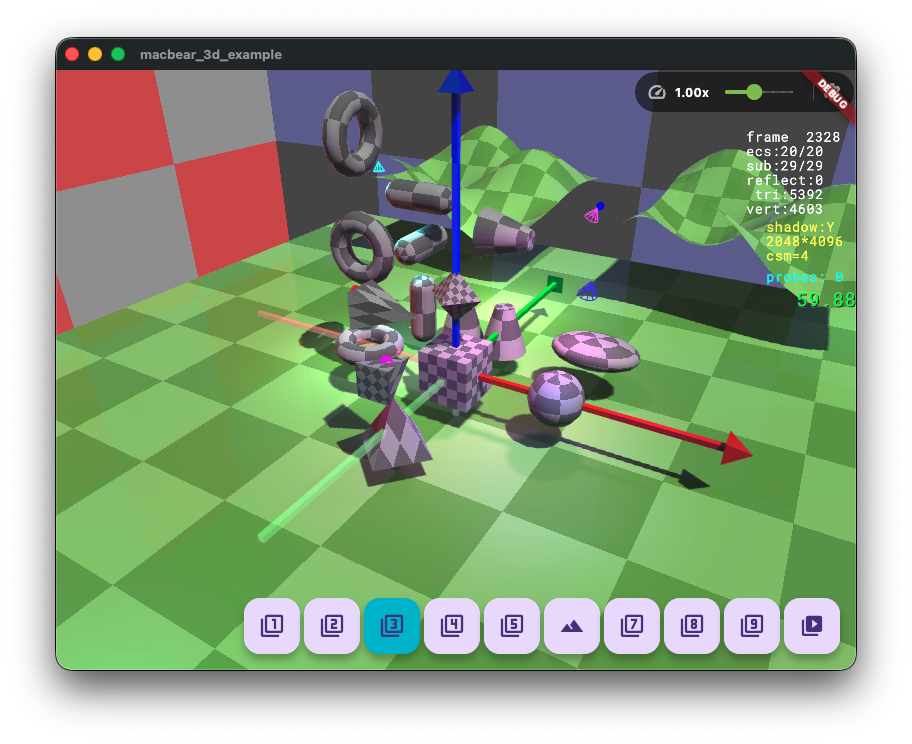
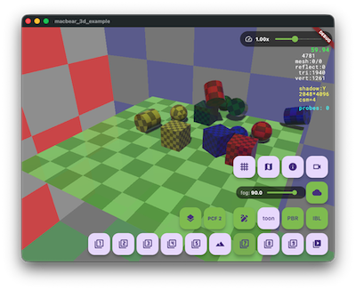
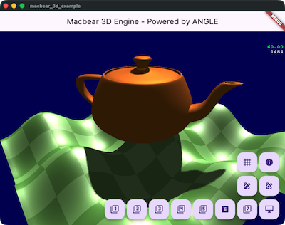
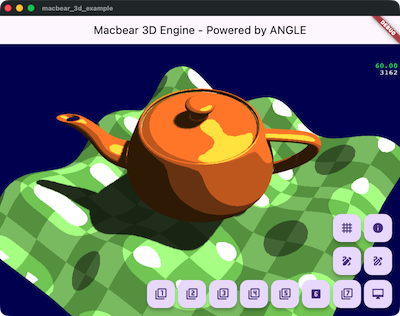
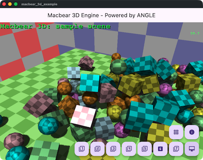
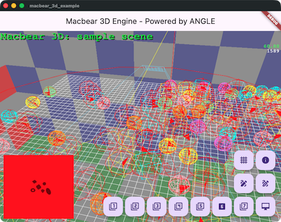

# Macbear 3D - OpenGL can, I will.

[English](README.md) | [繁體中文](README_zh.md)

[](https://pub.dev/packages/macbear_3d)
[](https://opensource.org/licenses/MIT)


**Macbear 3D** is a lightweight, high-performance 3D rendering engine for Flutter, powered by **Google ANGLE (OpenGL ES 3.0)**. It provides a simple yet powerful API to create stunning 3D experiences, games, and visualizations.

"There was no 3D engine for Flutter that I actually wanted to use. So I built one."

<p align="center">
  
  
</p>

### 🌐 [Live Web Demo](https://macbearchen.github.io/macbear_3d/)
Preview the `main_all.dart` example live in your browser!

## Key Features

### 🚀 Core Engine
- **Powered by ANGLE**: Direct **OpenGL ES 3.0** access via Google's ANGLE for high performance.
- **Scene Graph**: Hierarchical architecture with **M3Node** for flexible entity transformations and multi-camera support.
- **Resource Management**: Efficient centralized loading and caching for textures, meshes, and fonts, including `M3Resources.axisMesh` for coordinate systems.
- **Multi-Geometry Support**: Added `multi-M3SubMesh` to support multiple geometries within a single `M3Mesh`.
- **WebGL/Web Optimizations**: Platform abstraction and alignment adjustments optimized specifically for web builds.
- **Console Logger (M3Log)**: Built-in `M3Log` class for structured, ANSI-colored debug, info, warning, error, system, and highlight console logging.

### 🎨 Rendering & Visuals
- **Model Loaders**: Native support for **glTF/GLB**, **OBJ**, and **BVH** formats.
- **Skeletal Animation**: Full support for skinned meshes and bone-based animations (including `M3OctahedralGeom` for bone visualization).
- **Advanced Lighting**: Dynamic lighting supporting **1 directional light and 8 point lights**, **Cascaded Shadow Mapping (CSM)**, **PCF (Percentage Closer Filtering)** for smooth shadows, **PBR (Physically Based Rendering)** and **IBL (Image-Based Lighting)**. Improved `RenderPipeline` with enhanced support for opaque and transparency materials.
- **Modular Shaders**: Refactored shader system with clean `.glsl` source files and dedicated, type-safe Dart shader program wrappers (`M3FogShader`, `M3LightingShader`, `M3ShadowShader`, `M3WaterShader`) for easy uniform binding and encapsulation.
- **Skybox & Environment**: Support for skybox environment backgrounds and reflection mapping via cubemaps.
- **Planar Reflections**: Added support for planar reflections with `M3PlanarReflection` and Mirror shaders for high-quality reflective surfaces.
- **Dynamic Reflection Probe**: Added `M3ReflectionProbe` for real-time cubemap capture and dynamic reflections.
- **Water Effect**: Real-time water rendering with `M3Water` — dual-layer animated normal-map flow (supporting procedural water normal map generation at runtime via `M3Texture.createWaterNormalMap`), planar reflection & refraction, configurable wave distortion, and fog-depth underwater tinting.
- **Terrain System**: Generate procedural terrain utilizing Perlin Noise.
- **Fog Effect**: Introduced **M3Fog** supporting depth-based scene fog with camera-facing depth attenuation, custom color settings, and optional custom clip planes (e.g., for underwater depth tinting).
- **RenderContext**: `M3RenderContext` bundles per-frame GPU state (viewport, matrices, lights, shadow map, reflection/water targets) for clean multi-pass rendering.
- **Flexible Geometries**: Added `M3Axis` support for Torus, Capsule, Cylinder, and Plane for custom orientation.
- **Text Rendering**: Generate 3D geometry from TrueType/OpenType fonts with alignment fixes for Web.

### ⚙️ Physics & Interaction
- **Android Stability**: Automated selection between Vulkan and OpenGLES for optimal compatibility.
- **Integrated Physics**: Seamless integration with the **Rapier** rigid body physics engine (replacing Oimo). Added `Collider` and `RigidBody` system.
- **Collision Detection**: Automatic AABB and Bounding Sphere calculation.
- **Interaction**: Keyboard zoom support (+, -) and multi-touch orbit control.
- **Touch Input**: Built-in interaction handling for 3D objects and orbit control.
- **GUI Integration**: Seamlessly overlay and embed 2D GUI elements directly using standard Flutter widgets.

<p align="center">
  
  
</p>

<details>
<summary>More Screenshots</summary>
<p align="center">
  
  
  
  
  
  
  
</p>
</details>

## Installation

Add `macbear_3d` to your `pubspec.yaml`:

```yaml
dependencies:
  macbear_3d: ^0.9.3
```

## Usage

Here is a simple example to display a 3D scene:

```dart
import 'dart:math';
import 'package:flutter/material.dart' hide Colors;
import 'package:macbear_3d/macbear_3d.dart';

void main() {
  M3AppEngine.instance.onDidInit = onDidInit;

  runApp(const MyApp());
}

Future<void> onDidInit() async {
  debugPrint('main_example.dart: onDidInit');
  await M3AppEngine.instance.setScene(MyScene());
}

class MyApp extends StatelessWidget {
  const MyApp({super.key});

  @override
  Widget build(BuildContext context) {
    return MaterialApp(
      home: Scaffold(
        appBar: AppBar(title: const Text('Macbear 3D Example')),
        body: const M3View(),
      ),
    );
  }
}

// Define a simple scene
class MyScene extends M3Scene {
  @override
  Future<void> load() async {
    if (isLoaded) return;
    await super.load();

    camera.setEuler(pi / 6, -pi / 6, 0, distance: 8);

    // add box geometry
    addMesh(M3Mesh(M3BoxGeom(1.0, 1.0, 1.0)), Vector3.zero()).color = Colors.blue;

    // axis gizmo
    addMesh(M3Resources.axisGizmoMesh, Vector3.zero());

    // ground plane with matte material
    final mtrGround = M3Material()
      ..diffuse = Vector4(0.5, 0.5, 0.5, 1.0)
      ..setMatte();
    final groundMesh = M3Mesh(M3PlaneGeom(10, 10), material: mtrGround);
    addMesh(groundMesh, Vector3(0, 0, -1));
  }
}
```

## Setup

To protect your usage, ensure you set `M3AppEngine.instance.onDidInit = onDidInit` and implement `onDidInit` method, then use `M3View` widget.

## Generate UML Diagram

https://pub.dev/packages/dcdg
```
./uml/gen_uml.sh
```
output to uml/macbear_3d.puml

## Roadmap

- [ ] Post-processing effects (Bloom, HDR)
- [ ] Advanced Particle System
- [/] Multiple lights support (1 directional light and 8 point lights supported, Spot light in progress)

## Contributing

Contributions are welcome! Please feel free to check the [issues](https://github.com/macbearchen/macbear_3d/issues) or submit a Pull Request.

## Credits

### Motion Capture Data
This motion capture data is licensed by mocapdata.com, Eyes, JAPAN Co. Ltd. under the Creative Commons Attribution 2.1 Japan License.
To view a copy of this license, contact mocapdata.com, Eyes, JAPAN Co. Ltd. or visit http://creativecommons.org/licenses/by/2.1/jp/ .
http://mocapdata.com/
(C) Copyright Eyes, JAPAN Co. Ltd. 2008-2009.

## License

This project is licensed under the MIT License - see the [LICENSE](LICENSE) file for details.
