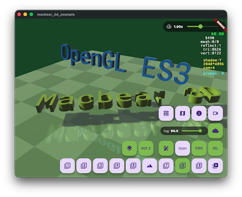
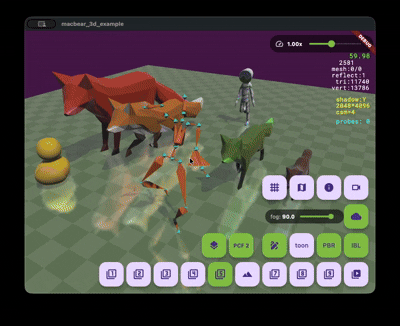
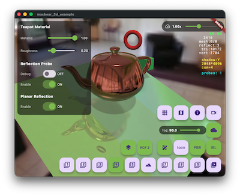

# 麥克熊 3D - OpenGL 能, 我來.

[English](README.md) | [繁體中文](README_zh.md)

[](https://pub.dev/packages/macbear_3d)
[](https://opensource.org/licenses/MIT)


**Macbear 3D** 是一個專為 Flutter 打造的輕量級、高性能 3D 渲染引擎，由 **Google ANGLE (OpenGL ES 3.0)** 驅動。它提供簡單且強大的 API，讓開發者能夠輕鬆創建驚艷的 3D 體驗、遊戲與視覺化應用。

「因為沒有合用的 Flutter 3D 引擎，所以自己做了一個」

<p align="center">
  
  
  
</p>

### 🌐 [線上即時演示](https://macbearchen.github.io/macbear_3d/)
在瀏覽器中直接預覽 `main_all.dart` 範例路徑！

## 主要特性

### 🚀 核心引擎
- **ANGLE 驅動**: 透過 Google ANGLE 直接整合 **OpenGL ES 3.0**，確保卓越性能。
- **場景圖 (Scene Graph)**: 基於 **M3Node** 的階層式架構，提供靈活的實體轉換與多攝影機系統。
- **資源管理**: 預建的高效集中式加載與快取機制（紋理、模型、字體），包含用於座標系的 `M3Resources.axisMesh`。
- **多重幾何支援**: 新增 `multi-M3SubMesh` 支援在單個 `M3Mesh` 中包含多個幾何體。
- **WebGL/Web 優化**: 針對 Web 建置優化平台抽象化與文字對齊調整。
- **控制台日誌工具 (M3Log)**：內建 `M3Log` 類別，支援結構化且具 ANSI 顏色的偵錯 (debug)、資訊 (info)、警告 (warning)、錯誤 (error)、系統 (system) 與高亮 (highlight) 控制台日誌輸出。

### 🎨 渲染與視覺
- **模型加載**: 原生支援 **glTF/GLB**、**OBJ** 與 **BVH (骨架動畫)** 格式。
- **骨架動畫**: 完整支援皮膚網格 (Skinned Mesh) 與基於骨骼的動畫系統 (包含 `M3OctahedralGeom` 骨骼視覺化)。
- **進階光照**: 支援 **1 盞方向光、8 盞點光源與聚光燈 (1 directional light, 8 point lights, and spotlight)**、動態光照、**級聯陰影貼圖 (CSM)**、**PCF (百分比漸進過濾)** 以實現平滑陰影、**PBR (實體渲染)** 與 **IBL (環境光照)**。優化 `RenderPipeline` 並增強對不透明與透明材質的支援。
- **模組化著色器 (Modular Shaders)**: 重構著色器系統，使用乾淨的 `.glsl` 原始碼檔案以及專屬、型別安全的 Dart 著色器程式封裝（`M3FogShader`、`M3LightingShader`、`M3ShadowShader`、`M3WaterShader`），提供更方便的 uniform 變數綁定與封裝。
- **天空盒與反射**: 支援天空盒背景以及透過 Cubemap 實現反射貼圖。
- **平面反射**: 加入 `M3PlanarReflection` 與專屬 Mirror Shader 以實現高品質平面反射效果。
- **動態反射探針**: 加入 `M3ReflectionProbe` 實作即時環境捕捉與動態反射。
- **水面效果**: 使用 `M3Water` 實現即時水面渲染，支援雙層動態法線貼圖流動（支援在執行期使用 `M3Texture.createWaterNormalMap` 程序化生成水面法線貼圖）、平面反射與折射、可調波紋扭曲，以及水下霧色深度渲染。
- **地形系統**: 支援使用 Perlin Noise 程序化生成地形。支援細節層級 (LOD 32x32 -> 16x16 -> 8x8 -> 4x4) 邊界縫合以及分區瓦片地形渲染 (`M3TiledTerrain`, `M3TerrainTileGeom`)。
- **霧化效果 (Fog Effect)**: 引入 **M3Fog** 支援深度場景霧化，具備相機深度衰減、自定義霧色，以及自定義裁剪平面（如用於水下霧化與深度顏色渲染）。
- **渲染上下文 (RenderContext)**: `M3RenderContext` 封裝每幀 GPU 狀態（視口、矩陣、光源、陰影貼圖、反射/水面目標），讓多通道渲染架構更清晰。
- **幾何形狀靈活性**: 為 Torus, Capsule, Cylinder 和 Plane 添加了 `M3Axis` 支持，允許自定義初始朝向。
- **3D 文字**: 支援從 TrueType/OpenType 字體直接生成 3D 文字幾何體，並修正 Web 端對齊問題。

### ⚙️ 物理與交互
- **Android 穩定性**: 自動在 Vulkan 與 OpenGLES 之間切換以確保最佳相容性。
- **整合物理引擎**: 無縫整合 **Rapier** 剛體物理引擎 (取代 Oimo)，並引入 `Collider` 與 `RigidBody` 系統。
- **碰撞檢測**: 自動計算 AABB 與包圍球 (Bounding Sphere)。
- **交互增強**: 新增鍵盤縮放支持 (+, -) 和多點觸控視角控制。
- **觸控輸入**: 內建 3D 物體互動處理與軌道攝影機 (Orbit Control) 支援。
- **GUI 整合**: 支援直接使用標準 Flutter Widget 無縫嵌入與重疊 2D GUI 介面。

## 安裝

在您的 `pubspec.yaml` 中加入 `macbear_3d`：

```yaml
dependencies:
  macbear_3d: ^0.10.0
```

## 快速上手

以下是一個顯示 3D 場景的簡單示例：

```dart
import 'dart:math';
import 'package:flutter/material.dart' hide Colors;
import 'package:macbear_3d/macbear_3d.dart';

void main() {
  M3AppEngine.instance.onDidInit = onDidInit;
  runApp(const MyApp());
}

Future<void> onDidInit() async {
  await M3AppEngine.instance.setScene(MyScene());
}

class MyApp extends StatelessWidget {
  const MyApp({super.key});

  @override
  Widget build(BuildContext context) {
    return const MaterialApp(
      home: Scaffold(
        body: M3View(),
      ),
    );
  }
}

class MyScene extends M3Scene {
  @override
  Future<void> load() async {
    if (isLoaded) return;
    await super.load();

    camera.setEuler(pi / 6, -pi / 6, 0, distance: 8);

    // 加入方塊幾何體
    addMesh(M3Mesh(M3BoxGeom(1.0, 1.0, 1.0)), Vector3.zero()).color = Colors.blue;

    // 座標輔助器 (Axis Gizmo)
    addMesh(M3Resources.axisGizmoMesh, Vector3.zero());

    // 使用不透明 (Matte) 材質的地面
    final mtrGround = M3Material()
      ..diffuse = Vector4(0.5, 0.5, 0.5, 1.0)
      ..setMatte();
    final groundMesh = M3Mesh(M3PlaneGeom(10, 10), material: mtrGround);
    addMesh(groundMesh, Vector3(0, 0, -1));
  }
}
```

## 路線圖

- [ ] 後處理特效 (Bloom, HDR)
- [ ] 進階粒子系統
- [/] 多光源支援 (已支援 1 盞方向光與 8 盞點光源，聚光燈開發中)

## 參與貢獻

歡迎任何形式的貢獻！如果您發現 Bug 或有新功能建議，請隨時提交 [Issues](https://github.com/macbearchen/macbear_3d/issues) 或 Pull Request。

## 鳴謝 (Credits)

This motion capture data is licensed by mocapdata.com, Eyes, JAPAN Co. Ltd. under the Creative Commons Attribution 2.1 Japan License.
To view a copy of this license, contact mocapdata.com, Eyes, JAPAN Co. Ltd. or visit http://creativecommons.org/licenses/by/2.1/jp/ .
http://mocapdata.com/
(C) Copyright Eyes, JAPAN Co. Ltd. 2008-2009.

## 開源協議

本專案採用 MIT 協議授權 - 詳情請參閱 [LICENSE](LICENSE) 文件。
